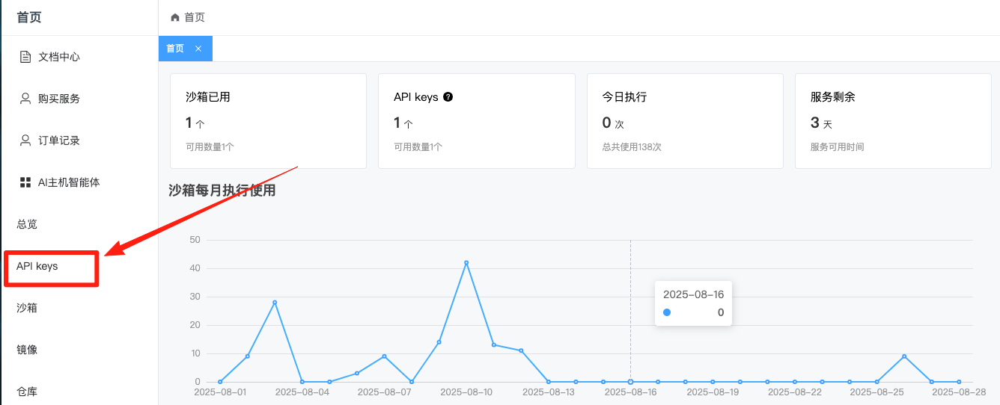
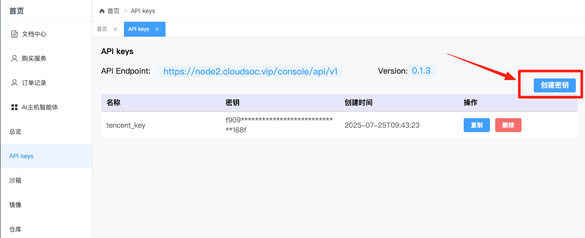

## kito-dify

## Overview
Kito is a powerful AI tool that pairs your AI agent with a dedicated Linux OS environment. This allows it to run system-level tools and supercharge its abilities, pushing the boundaries of what it can achieve.

## Configure

### 1. API Key Required

After installing the plugin, You can obtain a **Kito API Key** by signing up at [https://kito.cloudsoc.vip](https://kito.cloudsoc.vip).

### 2. Create your API key

+ First, Click your [API Keys] to access the console.

+ Then, Select [+ Create Apikey] to generate a new API Key. Customize a name, and note that the key will only be displayed once upon generation — ensure to copy and save it securely for uninterrupted future use.

### 3. Enter your API Endpoint and API key in the Plugin Settings

Once installed, configure the plugin with your API Endpoint and API key in the plugin settings page.

### 4. The kito-dify plugin includes the following function:

> RunCommand  
+  Run a command in a sandboxed Linux OS environment.

>UploadFile
+ Upload a file to a sandboxed Linux OS environment.

> GetWebService
+ Get WebService Address in the sandboxed Linux OS environment.

> GetMcpService
+ Get McpService Address in the sandboxed Linux OS environment.

> StartMcpServer
+ Start McpServer in the sandboxed Linux OS environment.

> StopMcpServer
+ Stop McpServer in the sandboxed Linux OS environment.

> ConfigMcpServer
+ Update the config content of mcp server.

## Key Features
* 🧠 Process 
    - Run Command in the Kito AI Host with a Linux OS environment

* 🌍 Filesystem 
    - Upload the AI Generated file to the kito AI Host
    - Access the file list of the Kito AI Host by Web browser

* 🚀 Service
    - MCP Server,Start MCP Server in your own Kito AI Host

See more info: [https://s.apifox.cn/2b306df6-5d22-423f-83ba-ed07415b13d5](https://s.apifox.cn/2b306df6-5d22-423f-83ba-ed07415b13d5)  

